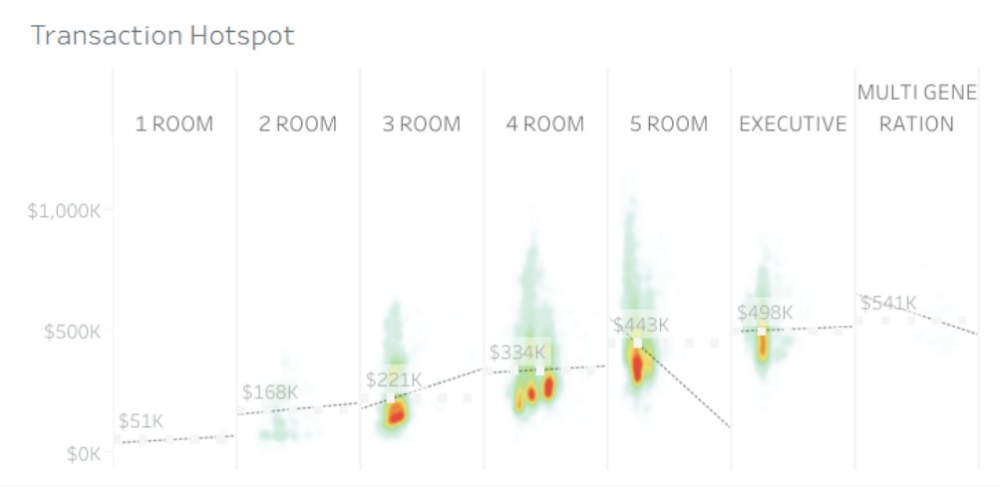
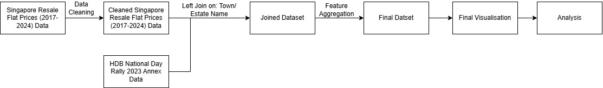

## Background and Motivation

Purchasing an HDB flat represents one of the most significant financial milestones for many households in Singapore. As resale transactions involve substantial financial commitment, understanding how prices vary across flat types is essential for informed decision-making.

While resale prices are often summarised using averages or headline figures, such statistics do not reflect the full pricing reality faced by buyers. Two flat types may share similar median prices, yet differ significantly in terms of price stability, variability, and the presence of high-value transactions. For households making long-term financial commitments, understanding how prices are distributed provides deeper insight into affordability, risk, and market behaviour.

---

## Visualisation That Inspired the Project

**Original visualisation (Tableau Public):**  
Singapore HDB Resale – Heatmap/Density view of resale price distribution by flat type  
<https://public.tableau.com/app/profile/fshih/viz/SingaporeHDBResale/HDBresale>

::: {#fig-original-viz}
{fig-alt="Original Tableau heatmap of HDB resale price distribution" width=850}
:::

The chosen visualisation presents a **density heatmap** of resale transactions across flat types.

It integrates multiple dimensions:

- **x-axis:** Flat type (1-Room to Multi-Generation)  
- **y-axis:** Resale price  
- **Colour intensity:** Transaction density  
  - Brighter regions indicate common price ranges  
  - Fainter regions indicate less frequent transactions or outliers  

The chart effectively highlights where transaction “hotspots” occur and provides an intuitive overview of how resale prices cluster within each flat category.

## Strengths and Weaknesses of Chosen Visualization

### Strengths

1. Handles high-volume data without overplotting  
   A traditional scatterplot with thousands of HDB resale transactions would collapse into a dense, unreadable mass of overlapping points — a problem known as overplotting. The heatmap resolves this by binning transactions into cells and encoding frequency as colour intensity, so even with tens of thousands of data points, the visual remains clean and interpretable. Each "cloud" effectively compresses thousands of individual observations into a single coherent shape, making it scalable in a way that raw scatter plots simply aren't at this data volume.

2. Immediate trend recognition  
   The dashed trend line combined with the density clouds creates a dual-encoding effect — viewers get both the directional pattern (rising median prices from 1-room to Multi-Generation) and a sense of where transactions actually cluster around that trend. This makes it particularly effective for a general audience unfamiliar with the underlying dataset.

3. Outlier visibility without distortion  
   Unlike a boxplot, which would hide the full distribution shape, or a bar chart, which would suppress spread entirely, this heatmap simultaneously shows the central transaction band (red/orange core) and the thin tails of outlier transactions (faint green scatter above and below). For 5-room flats, for instance, you can clearly see that while most transactions cluster around $443K, there is a meaningful tail extending toward $1M — information that would be lost in summary statistics alone.

### Weaknesses

1. Lack of statistical precision  
   While the colour gradient communicates relative density intuitively, it cannot substitute for hard statistical measures. A viewer cannot determine from this chart what is the median, interquartile range, standard deviation, or skewness. This ambiguity becomes a liability in analytical or policy contexts where stakeholders need defensible, precise numbers rather than visual impressions.

2. Unclear colour scale  
   The chart provides no legend explaining what the colour gradient actually represents — a viewer has no way of knowing whether the transition from green to red reflects a difference of a few dozen transactions or several thousand. This absence of a reference key forces viewers to interpret the colours purely on intuition, which can lead to very different readings of the same visual. Without any anchoring reference, the colour becomes a relative signal within each column rather than a consistent, comparable measure across the entire chart — undermining one of the core purposes of using a unified visual encoding in the first place.

3. Hidden variables are obscured  
   By aggregating all transactions into a single density cloud per flat type, the chart conflates what are actually quite distinct sub-markets. Mature estates and non-mature estates command significantly different price premiums, and within each flat type, the price distribution for these two groups would look very different. Blending them produces a single wide cloud that may give the false impression of high price variance being random, when in reality it is largely explained by estate maturity and location.
   
---

## Proposed Improvements to Current Visualisation

While the original heatmap effectively visualises transaction density, it prioritises visual intuition over statistical clarity. Our proposed redesign aims to retain distributional richness while introducing stronger precision and clearer comparative structure.

We will restructure the design into a **split violin plot with boxplot overlay**, providing both distribution shape and statistical precision.

### Structural Reconfiguration of the Visual

The original visualisation plots price against flat type using density encoding, but the distribution remains visually blended across all underlying sub-groups.

Our redesign introduces a **categorical x-axis explicitly segmented by flat type** (e.g., 3-Room, 4-Room, 5-Room, Executive), ensuring that each housing tier is visually separated into discrete analytical units.

This structural reconfiguration achieves two objectives:

1. It enhances comparability between housing categories.
2. It prevents visual blending across structurally distinct market segments.

While maintaining a clear **y-axis** for market valuation to identify **minimum entry cost** and **maximum valuation** per category.

### Introduction of a New Dimension (Estate Maturity)

One key weakness of the original heatmap is the concealment of structural sub-markets. Mature and non-mature estates are blended into a single density cloud per flat type.

Our redesign introduces a **split hue strategy**, where:

- Left half of each violin = Mature estates  
- Right half of each violin = Non-mature estates  

This modification makes estate maturity an explicit analytical dimension rather than a hidden variable. Instead of inferring variance indirectly from cloud width, viewers can now directly observe:

- Whether mature estates consistently exhibit higher medians  
- Whether price dispersion differs across estate types  
- Whether maturity-related premiums vary by flat category  

This transforms the visualisation from descriptive to comparative.

### Distribution Transparency Using Violin Geometry

The heatmap compresses distribution into colour intensity, which is visually intuitive but statistically ambiguous.

The violin plot replaces colour density with **kernel density estimation (KDE)** represented through shape width. This provides several analytical advantages:

- Reveals unimodal vs multi-modal price structures  
- Highlights skewness in higher-value flat categories  
- Makes tail behaviour (e.g., million-dollar transactions) structurally visible  

Crucially, the violin geometry enables the application of a **split hue strategy**, where each flat type is divided into two mirrored halves:

- **Left half = Mature estates**  
- **Right half = Non-mature estates**

By embedding maturity classification directly into the distribution shape, the redesign prevents structural blending of distinct sub-markets. Rather than aggregating all transactions into a single density cloud, the split violin allows viewers to compare distribution width, median positioning, and tail spread across maturity categories within the same flat type.

This design makes maturity-related variance visually explicit and analytically interpretable. Differences in distribution height, width, or skew between the two halves can now be evaluated directly, transforming the visualisation from a general density overview into a structured comparative analysis tool.

### Statistical Precision Using Boxplot Overlay

To address the absence of statistical landmarks in the original chart, we overlay a **boxplot inside each violin**.

The boxplot communicates:

- Median resale price  
- Interquartile range (IQR)  
- Extreme values (outliers)  

This hybrid design bridges visual intuition and quantitative rigor. Viewers no longer rely solely on colour gradients to estimate density instead they are provided with precise statistical reference points.

This enhancement is particularly important for policy interpretation and financial decision-making contexts, where explicit numerical indicators are required.

### Improved Interpretability of the Visualisation

Collectively, these improvements shift the visualisation from a density-based overview to a distribution-based analytical instrument.

The redesigned chart:

- Makes hidden structural differences visible  
- Provides measurable statistical benchmarks  
- Enhances cross-category comparability  
- Preserves distribution richness while reducing ambiguity  

Rather than merely illustrating where transactions cluster, the improved visualisation directly answers the core research question:

> What are the main factors in deciding HDB Resale Prices?

This ensures that the final visual output is not only visually compelling but analytically sound.

---

## Data Sources Used

This project integrates two complementary datasets to construct a distribution-based analysis of HDB resale prices.

### HDB Resale Flat Prices (2017–2024)

**Source:** data.gov.sg (Housing & Development Board)  
**Time Coverage:** January 2017 – December 2024  
**Purpose:** Main dataset from the initial visualisation  

This dataset forms the quantitative backbone of the project. Each row represents a single resale transaction and includes key attributes such as:

- `month`: transaction month  
- `town`: HDB town of the flat  
- `flat_type`: classification (e.g., 3-Room, 4-Room, 5-Room, Executive)  
- `floor_area_sqm`: unit size  
- `resale_price`: transaction price  
- `lease_commence_year`: original lease start  

The transaction-level granularity enables full reconstruction of price distributions rather than relying solely on pre-aggregated summaries. This is critical for distribution-focused visualisation methods such as violin plots, which require access to the underlying raw observations.

The dataset is well-suited for this study because:

- It covers multiple housing cycles (2017–2024), capturing both stable and rapidly rising price periods.  
- It provides sufficient volume for density-based analysis.  
- It includes structural variables (flat type, size, lease year) that support multi-dimensional comparisons.  

**Limitations:**  
The dataset does not include explicit geospatial coordinates, distance to amenities, or maturity classification. Therefore, additional enrichment is required to analyse maturity-related price effects.

### Estate Maturity Classification

**Source:** Data has been sourced from our own research  
**Purpose:** Introduces maturity dimension to our main dataset  

This dataset functions as a dimension table that enriches the transactional resale data. It maps each HDB town to a maturity classification.

Unlike the resale dataset, this table does not contain price information. Instead, it provides a categorical attribute that captures structural differences in estate development stage, accessibility, and amenity density.

The maturity classification is analytically important because:

- Mature estates are generally closer to city centres.  
- They typically have established transport connectivity and amenities.  
- They may command location-based price premiums independent of flat size.  

By joining this lookup table to the resale transactions, we introduce a new explanatory dimension that allows us to test whether observed price variance is random or structurally driven by estate maturity.

---

## Data Engineering Workflow
::: {#fig-workflow}
{fig-alt="Data engineering workflow from raw ingestion to visualization-ready dataset" width=850}
:::

### Data Cleaning 

Prior to analysis, the raw resale transaction records underwent specific transformation procedures to ensure data integrity. The temporal dimension which was originally recorded as a character string was parsed and converted into a precise Date object to facilitate time-series indexing. Additionally, to enable accurate record linkage with the "Town-Level Geospatial Reference" dataset, the geospatial identifier ('town') was normalized to uppercase, ensuring a consistent primary key for the subsequent relational join operations.

### Left Join on: Estate name

To integrate the resale transaction records with the "Town-Level Geospatial Reference" data, we established a common relational key using the 'town' variable. A preliminary schema inspection identified a formatting conflict as the reference dataset used uppercase syntax (e.g., "ANG MO KIO"), while the resale data utilized title case. To resolve this, we applied the str_to_upper() transformation to the resale dataset. This normalization harmonized the primary keys, enabling a successful left join that enriched all transaction records with the corresponding spatial attributes.

### Feature Aggregation

Following the join operation, transaction-level resale records were aggregated into analytical summaries to support distribution-based and comparative visualisation. Since raw transactions can be excessively granular and visually noisy, aggregation was performed to derive interpretable metrics such as median resale price, interquartile range (IQR), and transaction counts across key dimensions.

Specifically, we grouped the dataset by `flat_type` and `maturity_status` to compute central tendency and dispersion statistics. In addition, we generated time-based aggregates by `year` to support longitudinal trend comparisons between mature and non-mature estates. These aggregated tables form the “visualisation-ready” layer of the pipeline and reduce dependence on repetitive reprocessing during plotting.

### Final Visualisation
The final visualisation adopts the proposed **violin plot with boxplot overlay** to address the weaknesses identified in the original heatmap. The violin geometry preserves distributional shape and density, while the embedded boxplot provides statistical clarity through median and IQR markers. To explicitly evaluate the effect of estate maturity, the chart compares **mature vs non-mature** groups within each flat type category.

This design improves interpretability by (i) making between-group differences visually explicit, and (ii) providing precise distribution landmarks beyond colour intensity alone.

### Additional Data Analysis
Beyond visual inspection, we perform simple descriptive checks to support the narrative of maturity-related price differences. These checks focus on comparing median resale prices and price-per-square-metre (PSM) across maturity categories, and identifying which flat types exhibit the largest maturity premiums.

The maturity premium is computed as the difference in median prices between mature and non-mature estates for each flat type. This allows us to quantify whether maturity effects are uniform or more pronounced for larger flat categories.

---

## Proposed Work Distribution

| Name      | Distributed Work                                    |
|-----------|-----------------------------------------------------|
| Ming Yang | Data ingestion & data dictionary                    |
| Zi Xin    | Data cleaning (resale transactions)                 |
| Desmond   | Data cleaning (maturity lookup) & join              |
| Daryl     | Validation & metrics generation (e.g., median, IQR) |
| Zulhilmi  | Data visualisation & storytelling                   |

---

## Conclusion

This proposal outlines a structured approach to analysing HDB resale price distributions beyond commonly reported headline figures. By combining transaction-level resale data with a town-level estate maturity classification, the project constructs an enriched dataset that enables deeper examination of how resale prices vary across housing segments.

The proposed data engineering workflow ensures that the raw datasets are cleaned, integrated, and transformed into a visualisation-ready format. Through feature aggregation and validation steps, the pipeline prepares the data for meaningful comparative analysis while maintaining the integrity of the original transaction records.

To address the limitations of the original density heatmap, the project proposes a redesigned visualisation using **split violin plots with boxplot overlays**. This approach preserves distributional detail while introducing statistical clarity, allowing viewers to observe median prices, dispersion patterns, and potential outliers within each flat category. By explicitly separating mature and non-mature estates within each distribution, the improved visualisation makes structural differences in the housing market more transparent.

Ultimately, this project aims to demonstrate how thoughtful data engineering and improved visual design can transform raw housing transaction data into insights that are both analytically rigorous and accessible to a broader audience. Through this approach, the analysis moves beyond simple price summaries to reveal the underlying distributional patterns that shape Singapore’s HDB resale market.

---

## Reflection on the Use of AI Tools

AI tools were used in this project primarily as a support mechanism to enhance productivity and clarity. AI assisted in refining written explanations, improving the structure of the proposal, and suggesting clearer phrasing for technical descriptions.

During the data engineering stage, AI tools were also used to clarify R syntax, troubleshoot minor coding issues, and suggest alternative visualization techniques such as violin plots and boxplot overlays. These suggestions were critically evaluated and adapted by the team to ensure that the final design aligned with the project objectives and dataset characteristics.

Through this process, the team learned that while AI can accelerate ideation and problem-solving, human judgement remains essential in validating outputs, interpreting data meaningfully, and ensuring analytical rigor.
